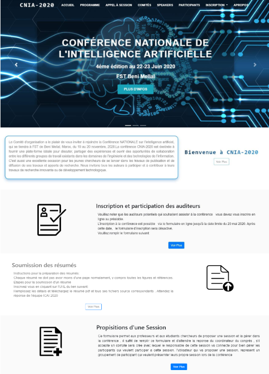
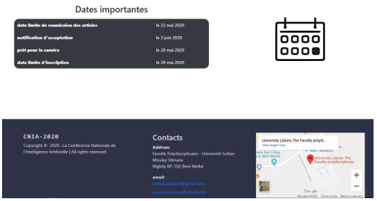
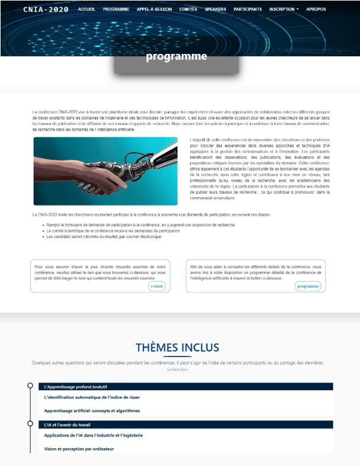
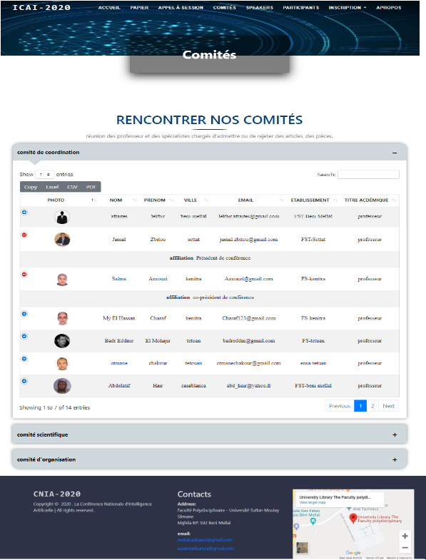

# Application for managing scientific events
 

## Description
Our application is divided into two parts: user part and administrator part.
- Firstly, we developed the user part (named **Site web**) which is a web site based on J2EE technology and it allows the user to see the different information about the conference, it also offers a registration form for the attendees who want to attend the conference and a form also for those who want to submit their abstracts to present their works, in addition to a form to propose a session.
- Secondly, the administrator part (named **Administration_Conference**) is a java application that facilitates the task for the conference manager to manage the attendees' requests, the important dates, the sessions proposals, the attendance and to publish the book of abstracts and the conference program and also for the session manager to manage the submitted works.
- Finally for the processing, we used the EJB (Enterprise Java Bean)(named **EJB_Conference**) which has two clients, the web site as a local client and the application as a remote client which uses the RMI protocol

## Visualization

